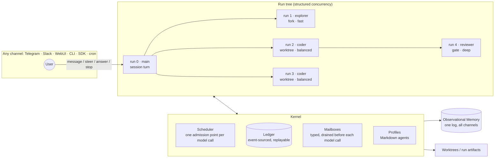

# nanobot Orchestration

Status: target architecture (design). Supersedes the first discovery draft.

> **One primitive, five parts, six tools.**
> Every piece of work in nanobot is a *run*. Runs form a tree, share one
> scheduler, one ledger and one memory, and can be stopped, steered, replayed or
> branched from any chat app. Delegating to ten agents costs little more than
> delegating to one, and nothing is ever lost when the process dies.

---

## 0. Why this, and why nanobot

Most agent frameworks bolt orchestration on top of a chat loop: a "spawn" tool,
a thread pool, results pasted back as text. They get demos, not systems. The
orchestration people talk about has four properties at once:

1. **It is cheap to go wide.** Fan-out does not multiply cost.
2. **It never loses work.** Crashes, restarts and `/stop` have exact semantics.
3. **Humans stay in the loop from anywhere.** You can watch, steer and answer
   agents from your phone.
4. **It gets better from its own history.** Every run is data.

nanobot is unusually well placed to have all four. It already has an immutable
per-run model runtime, mid-turn message injection before every model call,
durable turn checkpoints with recovery, typed runtime events, a context governor
with memory-backed compaction, Observational Memory shared across channels, and
a dozen chat channels. What it lacks is an orchestration layer that uses them:
today's subagents are flat, in-memory, fire-and-forget, run on the parent's
model, and report back by asking the parent to "summarize naturally for the
user" (§11).

This document is the converged design: everything that runs becomes one kind of
thing, and the few mechanisms that make it world class are built into that one
thing rather than added beside it.

---

## 1. The model in one picture



---

## 2. Five parts

### 2.1 Run

The only unit of work. A chat turn, a subagent, a cron job, a sustained goal, a
memory cycle: all runs.

```python
@dataclass(frozen=True)
class Run:
    id: str                    # sortable (ULID), stable across restarts
    root: str                  # the user-facing run that owns the tree
    parent: str | None
    profile: str               # which agent
    task: str
    runtime: LLMRuntime        # model, preset, effort: fixed at admission
    caps: Capabilities         # tools, MCP servers, paths, network, memory
    budget: Budget             # tokens, cost, wall time, iterations, fan-out
    context: Literal["fork", "brief", "fresh"]
    isolation: Literal["shared", "worktree"]
    gate: Gate | None          # acceptance check (§4.3)
    durable: bool              # False inside private sessions
    lifetime: Literal["scoped", "detached"]
```

Two invariants carry most of the design:

- **Structured concurrency.** A `scoped` run cannot outlive its parent. When a
  parent finishes, fails or is stopped, its scoped children are finished,
  cancelled or reported first. There are no orphans by construction. `detached`
  runs (background agents, §4.6) are explicit, owned by the session, and listed
  in `/agents`.
- **Capabilities only attenuate.** `child.caps = parent.caps ∩ profile.caps`.
  No tool, path, MCP server, network right, budget or memory right can grow
  down the tree. This is checked by property tests, not by convention.

A session is a long-lived run; its turns are child runs of it. That single
decision removes the separate code paths for chat turns, subagents, cron turns,
trigger turns and goal continuations (§8).

### 2.2 Profile

Agents are Markdown files with front matter, like skills: built-ins in
`nanobot/agents/`, plugin-provided, or your own in `<workspace>/agents/`.

```markdown
---
name: coder
description: Implements one bounded change and proves it with a check. Use for
  code edits that can be described in a paragraph.
tier: balanced            # fast | balanced | deep | <preset>
effort: medium
tools: [read_file, write_file, apply_patch, grep, glob, exec]
mcp: []
context: brief
isolation: worktree
gate: { run: "pytest -q {changed_tests}", escalate: true }
budget: { iterations: 40, wall: 900s, cost: $0.60 }
returns: 500 tokens
---
Make the change described in the task inside your worktree. Keep the diff
minimal. Finish with what changed, why, and the check result.
```

Built-ins are deliberately few: `main`, `general`, `explorer`, `researcher`,
`coder`, `reviewer`, `planner`. The main agent sees one line per profile in the
cached part of its prompt.

### 2.3 Mailbox

Every run has one. The runner already drains an injection queue before every
model call; today only chat turns use it. Giving every run a mailbox makes every
agent steerable with a mechanism that is already tested.

| Message | Direction | Effect |
|---|---|---|
| `steer` | parent or user → run | Arrives before the run's next model call |
| `ask` | run → parent (→ user) | Run pauses; the question travels up until someone answers or it times out into "proceed on your best assumption" |
| `answer` | down | Resumes the asking run |
| `result` | run → parent | Structured result (§2.6), delivered by the join |
| `note` | session ↔ session | Today's cross-session messages, same limits |

Addresses are uniform: `run:<id>`, `@session-handle`, `user`.

### 2.4 Ledger

An append-only, event-sourced log per root run, stored next to session files
with the same file locks. It records state transitions, every model request as
a delta over the previous one, every model response, every tool call and
result, usage and cost. Current state is a replay of the log.

The ledger is what makes three of the headline features possible: exact crash
semantics (§4.5), replay and branching (§4.7), and routing that learns (§4.8).
Private sessions use an in-memory ledger that disappears with them.

### 2.5 Scheduler

One admission point for **every model call**, implemented as a provider wrapper
(`ScheduledProvider`) in front of the existing `FallbackProvider`, so the runner
does not change.

- **Priority classes:** `interactive` › `awaited` (a parent is waiting) ›
  `background` › `automation` › `maintenance` (memory).
- **Provider lanes:** per provider and model, with adaptive concurrency
  (additive increase, multiplicative decrease on 429/overloaded, honoring
  `retry-after`). A saturated lane routes to the fallback chain instead of
  queuing.
- **Fairness:** weighted fair queuing by root run, so a 10-way fan-out in one
  chat does not slow another chat.
- **Cache affinity:** siblings that share a prefix are released close together
  so they hit the provider's cache while it is warm.

This replaces three unrelated throttles that exist today
(`NANOBOT_MAX_CONCURRENT_REQUESTS`, the subagent semaphore, memory's own
single-flight).

### 2.6 Results

```python
@dataclass(frozen=True)
class Result:
    status: Literal["ok", "partial", "failed", "cancelled", "interrupted"]
    summary: str               # bounded by the profile's `returns`
    data: dict | None          # validated against an output schema if given
    artifacts: list[str]       # files under runs/<root>/<run>/
    patch: str | None          # for worktree runs (§4.4)
    gate: GateOutcome | None   # what the check said (§4.3)
    usage: LLMUsage
    cost: float | None
```

Results are data for the parent, not messages for the user. The parent decides
whether to keep working, delegate again or reply. When the user is away, the
existing notification gate (`utils/evaluator.py`) decides whether a finished
background run deserves a ping.

---

## 3. Six tools

The model-facing surface is small, with defaults that make one call with two
arguments correct.

```text
agent(task, profile?, context?, tier?, effort?, wait?, group?, schema?, detach?)
    → run handle, or the Result when wait=true

join(runs? | group?, mode?: all | any | first_ok, timeout?)
    → finished Results + still-pending handles

send(to: run:… | @session | user, content, kind?: steer | answer | note)

stop(run, reason?)

runs(run?)              → the caller's tree: phase, tool, tokens, cost, elapsed

ask(question, timeout?) # inside child runs only; travels up the tree
```

`spawn`, `list_sessions` and `send_session_message` remain as aliases for one
release. Every error tells the model what to do next ("queued: 4 runs active;
call join or keep working").

---

## 4. The ten things that make it worth talking about

Each one is a mechanism with a number attached, not a slogan.

### 4.1 Cache-native fork-join

`context: fork` gives a child the parent's **exact** prompt prefix (system,
tools, transcript) and appends only the task. Profiles keep system prompts and
tool lists byte-stable (sorted tools, per-run values after the last cache
breakpoint). On providers with prompt caching (Anthropic `cache_control`,
OpenAI prompt caching) a fan-out of N forked children costs roughly one full
prefix read plus N cached reads, instead of N full reads, and each child starts
with everything the parent knew without the parent writing a brief.

**Number:** input-token cost of an N-way fork fan-out ≤ 1 + 0.15·N times a
single child's cost; ≥ 70% cache-hit rate on fan-out input tokens.

### 4.2 Structured concurrency: one stop stops everything

`/stop` (or a Stop button, or replying "stop" in Telegram) cancels the root
run; cancellation walks the tree depth-first, terminates exec sessions and
child processes, closes worktrees, and delivers `cancelled` results upward.
Joins return what finished. There is no state in which a child keeps spending
money after its parent is gone.

**Number:** full-tree stop < 1 s p99; zero surviving processes (tested).

### 4.3 Cascade routing with gates

A child starts on the cheapest tier its profile allows. Its result must pass a
**gate** before the parent sees `ok`:

- a schema (structured output validates),
- a check (`run: pytest -q …`, a linter, a script),
- or a reviewer (a `reviewer` run on a deeper tier for high-stakes profiles).

Fail → one retry one tier up with the failure attached; fail again →
`partial` with the gate output. Routing is deterministic and costs no extra
model call on the hot path. Effort is normalized per provider (`adaptive`,
`xhigh`, `none` are not universal) by a small capability table.

**Number:** on the delegation benchmark, ≥ 30% lower cost than running every
child on the main model at equal or better success.

### 4.4 Parallel coders that do not collide

`isolation: worktree` gives each coding run its own `git worktree` of the
project (a copy-on-write snapshot where the project is not a git repository).
Runs edit freely and in parallel; their result carries a patch. The parent
merges patches in order, re-runs the gate on the merged tree, and gets exact
conflicts back when two runs touched the same lines. Worktrees are removed when
the run closes.

**Number:** three parallel coder runs on independent files merge without
intervention; conflicting runs are detected 100% of the time (tested).

### 4.5 Nothing is ever lost

A result is written to the ledger before it is delivered (outbox) and
deduplicated by run id on delivery. On restart the kernel replays ledgers:
read-only runs resume from their last checkpoint; side-effecting runs report
`interrupted` with their partial work; each parent is woken once with the
batch. Child runs are stored as transient sessions, so their transcripts open
in the WebUI like any chat.

**Number:** a chaos test that kills the process at random points across 1,000
runs loses and duplicates zero results.

### 4.6 Background agents that work for days

`detach: true` (or a sustained `/goal`) creates a durable run owned by the
session, not the turn. It survives restarts, respects its budget and
schedule, reports through the notification gate, and appears in `/agents` and
the WebUI until it ends. Cron jobs and triggers are just scheduled detached
runs.

**Number:** a detached run survives three restarts mid-task and completes
within its budget (tested with the simulator, §7).

### 4.7 Replay and branch any run

Because the ledger holds every request delta, response and tool result, any run
can be replayed exactly (recorded tool outputs, no side effects) and **branched
from any step**: "redo from step 7 on `deep`", "rerun this subtree with the
new `researcher` prompt". The branch runs in a worktree or dry-run sandbox, and
the WebUI shows a diff of the two outcomes. Debugging an agent becomes
bisecting a log.

**Number:** replay of a recorded run reproduces its transcript byte for byte
until the branch point.

### 4.8 Routing that learns from its own ledger

Every finished run is a labeled example: profile, tier, effort, task features,
gate outcome, cost, latency. An offline job (a maintenance-priority run)
proposes tier changes per profile ("`explorer` succeeds on `fast` 97% of the
time; `coder` on `fast` fails its gate 41% of the time") as a reviewable diff
to the profile files. Nothing changes without a human accepting it. Replay
(§4.7) lets a proposal be evaluated on real past tasks before it is accepted.

**Number:** accepted proposals must show lower cost at equal gate pass rate on
replayed history.

### 4.9 Orchestration you can drive from your phone

nanobot lives in chat apps, so the run tree does too:

- one **live status message** per root run, edited in place ("coder ✓,
  coder ⟳ 3/40, reviewer queued · $0.21"), on channels that support edits;
  the WebUI shows the full tree with transcripts;
- **reply to steer**: a reply to the status message is a `steer` to the root;
  `@coder …` steers one run;
- **ask travels to you**: a child's `ask` that no ancestor can answer becomes a
  question in your chat, and your reply resumes it.

**Number:** first visible progress in the chat < 2 s after a delegation
starts.

### 4.10 Memory-native

Observational Memory already watches every durable conversation. In this design
it also watches the tree: child results enter the parent's transcript, so what
the agents learned becomes observations for every channel, without children
ever writing memory. Children of durable sessions can receive the observation
block in their cached prefix; children of private sessions get nothing and
leave nothing (including no read access to `memory/observations.md`, see §11).

---

## 5. Context economics

What a child sees, and what it costs:

| Mode | Child sees | Cost on caching providers | Default for |
|---|---|---|---|
| `fork` | Parent's exact prefix + task | Low (cached prefix) | `general`, `explorer`, `planner` |
| `brief` | Profile prompt + task + parent's brief + referenced paths | Low | `coder`, `researcher` |
| `fresh` | Profile prompt + task | Lowest | Self-contained lookups, `reviewer` (independence) |

Rules:

- Returns are bounded (`returns`); everything larger goes to artifacts and
  travels as a path.
- Results arriving during a parent's model loop are delivered as **one**
  injection per drain; results arriving while it is idle wake it **once per
  group**.
- Every run uses the same context governor and memory compactor, so long
  children compact instead of failing.
- Dynamic values (time, budget left, run ids) always go after the last cache
  breakpoint.

---

## 6. Performance budget

| Metric | Target |
|---|---|
| Kernel overhead per run, excluding model time | < 20 ms p95 |
| Parent wake-ups for a group of N children | 1 |
| Full-tree stop | < 1 s p99 |
| Fork fan-out input cost | ≤ 1 + 0.15·N single-child cost |
| Cross-chat interference from a 10-way fan-out | < 20% p95 first-token latency |
| Lost or duplicated results under chaos testing | 0 |
| Child tool execution | Concurrent for concurrency-safe tools (today: serial) |

---

## 7. How it is proven

**Deterministic simulation.** A scripted provider, a virtual clock and fault
injection (crash, 429, timeout, slow tool) run whole trees in milliseconds.
Every invariant in this document is a simulation test: no orphans, capability
attenuation, exactly-once results, budget enforcement, fairness, wake-up
counts, byte-stable prefixes, replay fidelity. The suite runs in CI.

**Live benchmark.** Around 30 delegation tasks with automatic checkers
(explore a code base, multi-source research, parallel implement-and-review,
fan-out summarization), run against today's `spawn` as the baseline. Published
per release: success rate, cost, wall time, parent tokens, cache-hit rate.

**Scoreboard for "A+":** every simulation invariant green; benchmark success ≥
baseline at ≥ 30% lower cost and ≥ 25% lower wall time on parallelizable tasks;
all numbers in §4 and §6 met.

---

## 8. Convergence: what disappears

| Today | Becomes |
|---|---|
| `SubagentManager`, `spawn` tool, subagent announce template | `agent` / `join` over runs |
| Two runner configurations (`loop.py` l.1235, `subagent.py` l.449) | One `RunExecutor` |
| `send_session_message`, `list_sessions` | `send` / `runs` with `@handles` |
| Cron turns, local-trigger turns, heartbeat, goal continuations, their coordinators | Scheduled or detached runs |
| `NANOBOT_MAX_CONCURRENT_REQUESTS`, subagent semaphore, memory single-flight | The scheduler |
| Static `_scopes` on tool classes | Capability intersection |
| Private `_task_statuses` read by the `self` tool and runtime control | `runs()` / ledger snapshot |
| `AgentLoop` as ingress + scheduler + router + locator (2,538 lines, 35 constructor parameters) | Ingress + session run; `AgentLoop` kept as a thin facade for the SDK |

Kept unchanged: `AgentRunner`, `ContextGovernor`, providers and the fallback
chain, `LLMRuntime` / `ModelRuntimeResolver`, the bus, session storage,
recovery, hooks, Observational Memory.

**Size budget:** the kernel (`nanobot/orchestration/`) stays under 3,000
lines; no new runtime dependencies; in-process `asyncio` only.

---

## 9. Non-goals (what keeps it lean)

- No distributed cluster, broker or database server. One process per
  workspace, files on disk.
- No LLM call to pick a model on the hot path.
- No graph DSL or workflow language. Profiles and six tools are the whole
  surface; the model composes them.
- No agent "chat rooms" or debate by default. Agents talk through their parent
  unless a profile allows `send`.
- No autonomous self-modification. Learned routing proposes; people accept.

---

## 10. Build order

Each milestone is shippable and demo-able on its own, keeps the test suite
green and keeps today's tools working through aliases.

| # | Milestone | Demo |
|---|---|---|
| 1 | **Runs + executor + simulator.** One execution path; mailboxes for every run; concurrent child tools; the deterministic simulator | Steer a running subagent from the WebUI |
| 2 | **Scheduler + profiles + cascade routing.** Lanes, priorities, fairness; Markdown profiles; tiers, effort, gates | Fan-out of `explorer`s on `fast` with a `reviewer` gate, cheaper than today's `spawn` |
| 3 | **Tree + joins + structured concurrency.** `agent`/`join`/`stop`/`runs`, groups, budgets, one wake-up per group | `/stop` kills a 3-level tree in under a second |
| 4 | **Ledger + durability + detached runs.** Outbox, restart semantics, cron/goals as runs | `kill -9` mid-fan-out, restart, every result arrives once |
| 5 | **Worktrees + fork caching.** Parallel coders with patch merge; byte-stable prefixes | Three coders in parallel, merged and tested |
| 6 | **Chat-native control + ask.** Live status messages, reply-to-steer, questions to the user | Answer a child's question from Telegram |
| 7 | **Replay, branching and learned routing** | "Redo from step 7 on deep", side-by-side diff; first routing proposal |

---

## 11. Where nanobot is today (evidence)

| Area | Grade | Evidence |
|---|---|---|
| Foundation | A− | Frozen `LLMRuntime` (`utils/llm_runtime.py`); injection before every model call (`runner.py` `_try_drain_injections`); per-session FIFO workers (`loop.py` `_run_session_queue`); checkpoints and `session/recovery.py`; typed events (`bus/runtime_events.py`); hooks (`agent/hook.py`) |
| Context | B+ | `context_governance.py`, memory compactor, cache markers (`anthropic_provider.py` `_apply_cache_control`); children start with no context |
| Performance | B− | Main turns run tools concurrently (`loop.py` l.1244), children do not; three unrelated throttles |
| Spawning | C+ | `spawn(task, label, temperature, wait)` on the parent's runtime (`tools/spawn.py`); no MCP for children (`subagent.py` `_build_tools`, `tools/loader.py` `_SKIP_MODULES`); no nesting |
| Management | C | In-memory `_task_statuses`, removed on completion; nothing in recovery; cancel only per session (`cancel_by_session`) |
| Communication | C+ | Results as rendered text through the bus; no steering or questions; session messages rate-limited to 6/min |
| Routing and effort | C / C− | `resolve_preset`, per-session presets and `with_generation_overrides(reasoning_effort=…)` exist and are unused by delegation |
| Collection | C− | `templates/agent/subagent_announce.md` asks the parent to "summarize naturally for the user"; an idle parent pays one model call per result |
| Observability | C+ | Good usage accounting; child status only via the `self` tool |

**Privacy finding from the discovery.** `read_file` whitelists
`memory/observations.md` for every session (`agent/tools/filesystem.py`,
`extra_read_allowed_files`), including private sessions and their subagents.
The memory integration keeps the log out of private prompts, but a tool call
can still read it. §4.10 closes this; it is also a small standalone fix.

---

## 12. Open decisions

1. **Ledger format:** JSONL next to sessions (proposed; consistent, greppable)
   or SQLite (faster queries for replay UI and learned routing).
2. **Default context for `general`:** `fork` (proposed, once cache-hit rates
   are measured per provider) or `brief`.
3. **Nesting:** depth 2 through `planner` only (proposed) or none in the first
   release.
4. **Worktree fallback** for non-git projects: copy-on-write snapshot
   (proposed) or disallow `isolation: worktree`.
